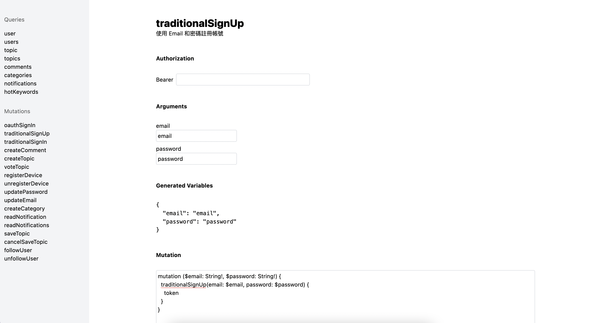

# GraphQL GUI

> ⚠️ This tool is still under development. It is welcome to contribute!

Automatically generate GraphQL queries and mutations from your GraphQL schema.

You don't need to write the mutation's variables yourself, including the file upload.

